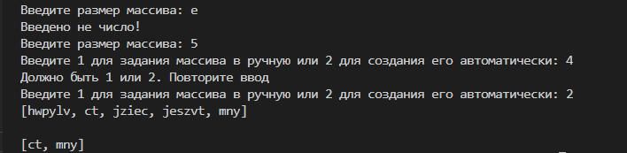

# Итоговая работа
## 1. Назначение программы.
Программа предназначена для выборки из исходного массива строк элементов с длиной строки не более 3 символов и формирования из них нового массива. Исходный массив может задаваться в ручную с клавиатуры или автоматически формироваться из случайных строк длиной от 1 до 7 символов. Размер исходного массива вводится с клавиатуры. Исходный и сформированный массивы выводятся на консоль. В программе реализована проверка правильности вводимых данных.
## 2. Описание программы.
Программа написана на языке C#. Состоит из основного блока и 5 функций.
### 2.1 Функция PrintArray.
Получает в качестве аргумента массив, который выводит на консоль.
### 2.2 Функция SelectionFromArrayToArray.
Получает в качестве аргумента массив строк, из которого выбирает элементы длиной не более 3 символов. Возвращает массив строк, состоящий из выбранных элементов.
### 2.3 Функция IntParseInput.
Получает в качестве аргумента строку, описывающую, какое числовое значение необходимо ввести с клавиатуры, выводит ее на консоль. Проверяет введенное с клавиатуры и выдает сообщение "Введено не число!", если ввели не число. Возвращает введенное число.
### 2.4 Функция CreateArrayRandom.
Получает в качестве аргумента целое число, которое является размером массива. Генерирует строковые элементы массива длиной от 1 до 7, состоящие из случайных букв английского алфавита нижнего регистра. Возвращает массив строк.
### 2.5 Функция InputArrayFromConsole
Получает в качестве аргумента целое число, которое является размером массива. Реализует ввод элементов массива с клавиатуры. Возвращает массив строк.
### 2.6 Основной блок.
Выводит на консоль приглашение ввести размер массива - "Введите размер массива:". Предлагает выбрать вариант задания исходного массива - "Введите 1 для задания массива в ручную или 2 для создания его автоматически:". Проверяет введенное значение. Если введена 1 - запускает функцию **InputArrayFromConsole**, если введена 2 - запускает функцию **CreateArrayRandom**, если введено другое число - выводит сообщение "Должно быть 1 или 2. Повторите ввод". С помощью функции **PrintArray** выводит на консоль исходный массив и массив сформированный с помощью функции **SelectionFromArrayToArray**.

*Скрин работы программы в терминале:*

